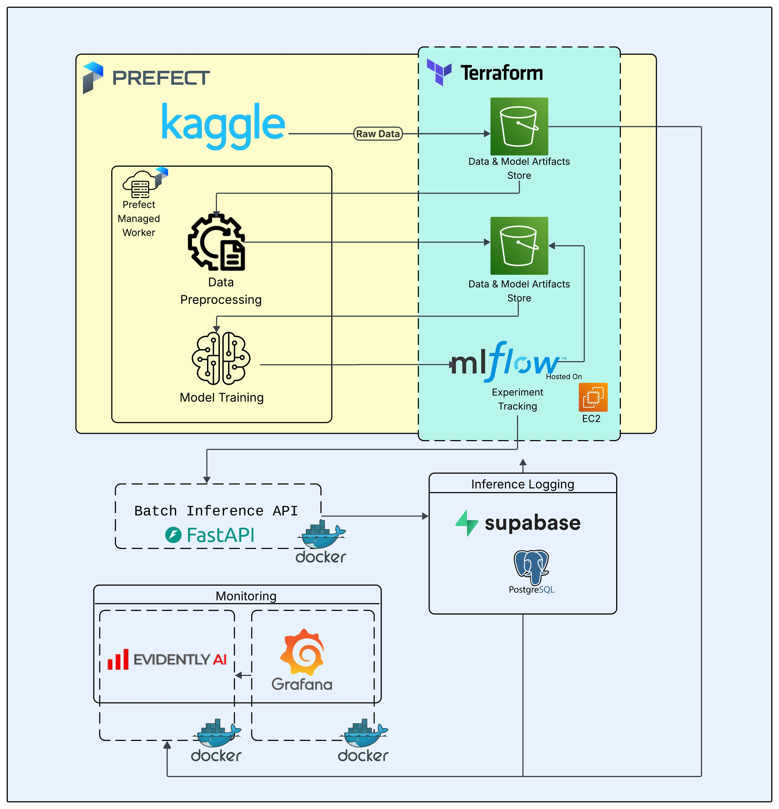
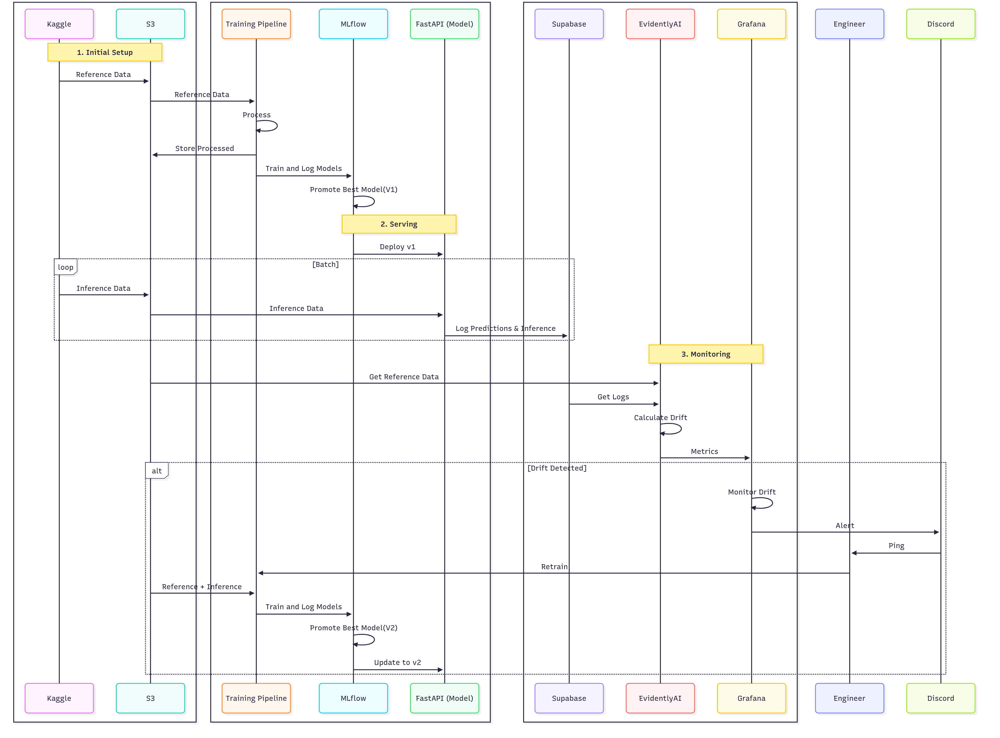

# Solar Radiation Prediction: An End-to-End MLOps Project

## Project Description

This project outlines an end-to-end Machine Learning Operations (MLOps) pipeline designed to accurately predict solar radiation levels. Leveraging historical weather and solar data, this system aims to provide reliable forecasts that can significantly enhance the efficiency and stability of solar energy generation and grid integration. From data ingestion and model training to continuous deployment and monitoring, this project demonstrates a robust framework for operationalizing machine learning models in a critical renewable energy domain.

## Problem Statement: Harnessing the Sun's Power, Reliably

Imagine a world where we can precisely predict how much solar energy will hit our panels, not just today, but for the next few hours, days, or even weeks. This isn't just a dream for a few tech enthusiasts; it's crucial for **optimizing renewable energy production**, a cornerstone of our future energy security.

Currently, operating solar farms, integrating solar power into the grid, or even just planning your personal energy consumption with rooftop solar panels, is a bit like driving with a foggy windshield. We know the sun's out there, but we're often reacting to its immediate presence rather than proactively planning for its fluctuating output. Unexpected clouds, changes in atmospheric conditions, or even just the time of day can significantly impact how much energy is actually generated. This uncertainty leads to:

* **Financial losses:** Solar farms might not generate expected revenue, or utilities might need to fire up expensive, less green backup power sources unexpectedly.

* **Grid instability:** A sudden drop or surge in solar power can destabilize the electrical grid, potentially leading to outages.

* **Inefficient energy storage:** If we don't know how much solar power is coming, we can't efficiently charge batteries or manage other storage solutions.

* **Suboptimal policy and investment:** Without reliable predictions, it's harder for governments and businesses to make informed decisions about investing in and integrating solar infrastructure.

### Why an MLOps Pipeline is Our Sunny Solution

This is where a **Machine Learning Operations (MLOps) pipeline** becomes our game-changer. We can train sophisticated machine learning models on historical weather and solar radiation data to accurately predict future solar output. But a model, no matter how good, isn't enough on its own. It's like having a brilliant chef without a fully equipped kitchen, a steady supply chain, or a reliable way to get the food to the table.

An MLOps pipeline addresses this by providing the "kitchen" and "delivery system" for our solar prediction model. It would help us:

* **Continuously improve predictions:** Weather patterns change, and our models need to learn from the latest data. MLOps automates the process of collecting new data, retraining models, and testing their accuracy, ensuring our predictions are always as sharp as possible.

* **Ensure reliability and consistency:** It provides a robust, automated way to deploy these models into production, making sure they're always running, accessible, and delivering predictions consistently, without manual intervention.

* **Monitor for performance issues:** Just like a car needs regular checks, models can degrade over time. An MLOps pipeline would automatically monitor our model's performance, alerting us if its predictions start to go off-track, allowing for quick adjustments.

* **Scale effortlessly:** As more solar data becomes available or as our need for predictions grows (e.g., predicting for multiple locations), the pipeline can seamlessly scale to handle the increased load.

Ultimately, by implementing an MLOps pipeline for solar radiation prediction, we move from reactive guesswork to **proactive, data-driven decision-making**. This empowers us to fully unlock the potential of solar energy, leading to a more stable, efficient, and sustainable power future.

## Dataset Description

The dataset used in this project was sourced from kaggle and is from the HI-SEAS weather station and it consists of historical environmental and solar radiation measurements collected at regular intervals. Each row represents a specific time point with various atmospheric and solar parameters. This time-series data is crucial for training machine learning models to identify patterns and predict future solar radiation.
https://www.kaggle.com/datasets/dronio/SolarEnergy

The dataset includes the following columns:

* **UNIXTime**: The Unix timestamp, representing the number of seconds that have elapsed since January 1, 1970 (UTC).

* **Data**: The date of the recording (e.g., 9/1/2016).

* **Time**: The time of the recording in HH:MM:SS format (e.g., 19:10:06).

* **Radiation**: The solar radiation level, likely measured in W/m$^2$ (Watts per square meter). This is the primary target variable for prediction.

* **Temperature**: The ambient temperature, likely in Fahrenheit.

* **Pressure**: The atmospheric pressure, likely in inches of Mercury (inHg).

* **Humidity**: The relative humidity percentage.

* **WindDirection_Degrees**: The direction of the wind in degrees (0-360).

* **Speed**: The wind speed.
* **TimeSunRise**: The time of sunrise for the given date.

* **TimeSunSet**: The time of sunset for the given date.

This rich set of features provides the necessary context for a machine learning model to learn the complex relationships between environmental factors and solar radiation.

## Project Structure

```
solar-prediction-mlops_zoomcamp/
├── 📄 Root Files
│   ├── config.py                 # Main configuration settings
│   ├── requirements.txt          # Python dependencies
│   ├── pipeline.py               # Main ML pipeline orchestration
│   ├── retrain.py                # Model retraining script
│   ├── prefect_deployment.py     # Prefect workflow deployment
│   ├── docker-compose.yml        # Docker Compose configuration
│   ├── Makefile                  # Build automation and commands
│   └── README.md                 # Project documentation
│
├── 🤖 ML Pipeline (`mlpipeline/`)
│   ├── data_preparation.py       # Data preprocessing and feature engineering
│   ├── model_training.py         # Model training logic
│   ├── evaluate_and_register.py  # Model evaluation and MLflow registration
│   ├── model_logging.py          # MLflow logging utilities
│   └── preprocessing_utils.py    # Preprocessing helper functions
│
├── 🚀 API Service (`api/`)
│   ├── serve_model.py            # FastAPI model serving
│   ├── schemas.py                # Pydantic data schemas
│   └── wait_for_mlflow_model.py  # Model loading utilities
│
├── 🧪 Testing (`tests/`)
│   ├── unit_tests/               # Unit test modules
│   └── integration_tests/        # Integration test modules
│
├── 📊 Data (`data/`)
│   ├── training_data.csv         # Training dataset
│   ├── inference_data.csv        # Inference dataset
│   └── new_data/                 # New data for retraining
│
├── 🐳 Docker (`docker/`)
│   ├── api/                      # API service Dockerfile
│   ├── monitoring/               # Monitoring service Dockerfile
│   ├── build.sh                  # Docker build script
│   ├── start_api_container.sh    # API container startup
│   └── start_monitoring_container.sh # Monitoring container startup
│  
│
└── ☁️ Infrastructure (`terraform/`)
    ├── main.tf                   # Main Terraform configuration
    ├── variables.tf              # Terraform variables
    └── terraform.tfstate         # Current state
```

## Tech Stack
- **Prefect Cloud**: For workflow orchestration and managed infrastructure.
- **AWS S3**: Serves as storage for data, model artifacts, and monitoring reports.
- **MLFlow**: Used for tracking experiments, models, and their associated metadata.
- **AWS EC2**: Server for hosting MLFlow.
- **Docker**: Used for containerizing the deployed model and monitoring services.
- **FastAPI**: Serves as the backend framework for deploying the machine learning model as a RESTful API.
- **Superbase**: Database for logging predictions and storing model inference metadata.
- **Evidently AI**: For monitoring Data Drift.
- **Prometheus**: Used for scraping and storing metrics related to model performance
- **Grafanaa**: interactive dashboard to monitor and analyze model performance metrics.
- **Terraform**:  Infrastructure-as-Code tool for automating and managing cloud resources.
- **Github Actions**: Automates CI/CD workflows for testing, building, and deploying ML services.

## Architecture Diagram


## Sequence Diagram


### Operation
