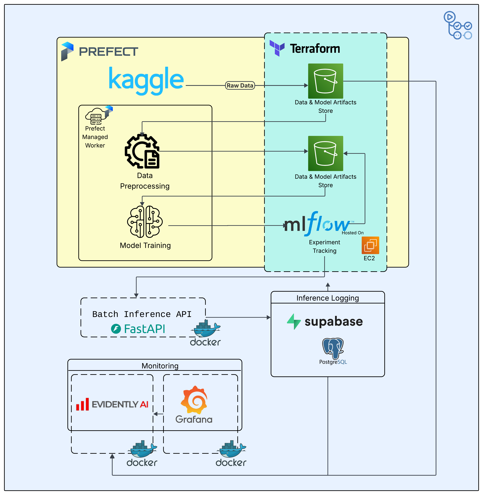
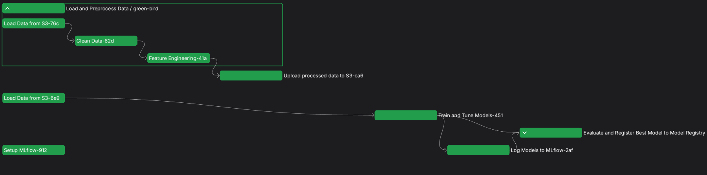
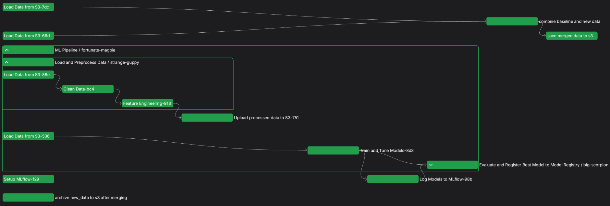

# **Solar Radiation Prediction: An End-to-End MLOps Project**

## **Table of Contents**

- [**Project Description**](#project-description)
- [**Problem Statement: Harnessing the Sun's Power, Reliably**](#problem-statement-harnessing-the-suns-power-reliably)
  - [**Why an MLOps Pipeline is Our Sunny Solution**](#why-an-mlops-pipeline-is-our-sunny-solution)
- [**Dataset Description**](#dataset-description)
- [**Project Structure**](#project-structure)
- [**Tech Stack**](#tech-stack)
- [**Architecture Diagram**](#architecture-diagram)
- [**Sequence Diagram**](#sequence-diagram)
- [**Prefect Deployments**](#prefect-deployments)
  - [**Operation**](#operation)
    - [**1. Data Ingestion**](#-1-data-ingestion)
    - [**2. Data Processing**](#-2-data-processing)
    - [**3. Model Training**](#-3-model-training)
    - [**4. Model Selection & Evaluation**](#-4-model-selection--evaluation)
    - [**5. Model Serving**](#-5-model-serving)
    - [**6. Logging Inference Data**](#-6-logging-inference-data)
    - [**7. Monitoring & Drift Detection**](#-7-monitoring--drift-detection)
    - [**8. Model Retraining**](#-8-model-retraining)
    - [**9. Model Reload**](#-9-model-reload)
- [**Installation**](#installation)
  - [**Quick Navigation**](#quick-navigation)
  - [**Python Environment Setup**](#python-environment-setup)
  - [**Environment Setup**](#environment-setup)
  - [**Supabase Setup**](#supabase-setup)
    - [**Create Table in Supabase**](#create-table-in-supabase)
  - [**AWS Configuration**](#️-aws-configuration)
  - [**Initialize Infrastructure with Terraform**](#initialize-infrastructure-with-terraform)
  - [**Simulate Data Ingestion**](#simulate-data-ingestion)
  - [**Docker Services Setup**](#docker-services-setup)
  - [**Prefect Setup (Local Mode)**](#prefect-setup-local-mode)
  - [**Run the Pipeline Script**](#run-the-pipeline-script)
  - [**Test the Model API**](#test-the-model-api)
  - [**Monitoring and Reporting**](#monitoring-and-reporting)
  - [**Trigger Retraining**](#trigger-retraining)
  - [**Repeat the Process**](#repeat-the-process)
  - [**Clean Up**](#clean-up)
    - [**Terraform**](#terraform)
    - [**Docker**](#docker)
- [**Best Practices**](#best-practices)
- [**Improvements and Recommendations**](#improvements-and-recommendations)
- [**Conclusion**](#conclusion)
- [**Licence**](#licence)

## **Project Description**

This project outlines an end-to-end Machine Learning Operations (MLOps) pipeline designed to accurately predict solar radiation levels. Leveraging historical weather and solar data, this system aims to provide reliable forecasts that can significantly enhance the efficiency and stability of solar energy generation and grid integration. From data ingestion and model training to continuous deployment and monitoring, this project demonstrates a robust framework for operationalizing machine learning models in a critical renewable energy domain.

## **Problem Statement: Harnessing the Sun's Power, Reliably**

Imagine a world where we can precisely predict how much solar energy will hit our panels, not just today, but for the next few hours, days, or even weeks. This isn't just a dream for a few tech enthusiasts; it's crucial for **optimizing renewable energy production**, a cornerstone of our future energy security.

Currently, operating solar farms, integrating solar power into the grid, or even just planning your personal energy consumption with rooftop solar panels, is a bit like driving with a foggy windshield. We know the sun's out there, but we're often reacting to its immediate presence rather than proactively planning for its fluctuating output. Unexpected clouds, changes in atmospheric conditions, or even just the time of day can significantly impact how much energy is actually generated. This uncertainty leads to:

* **Financial losses:** Solar farms might not generate expected revenue, or utilities might need to fire up expensive, less green backup power sources unexpectedly.

* **Grid instability:** A sudden drop or surge in solar power can destabilize the electrical grid, potentially leading to outages.

* **Inefficient energy storage:** If we don't know how much solar power is coming, we can't efficiently charge batteries or manage other storage solutions.

* **Suboptimal policy and investment:** Without reliable predictions, it's harder for governments and businesses to make informed decisions about investing in and integrating solar infrastructure.

### **Why an MLOps Pipeline is Our Sunny Solution**

This is where a **Machine Learning Operations (MLOps) pipeline** becomes our game-changer. We can train sophisticated machine learning models on historical weather and solar radiation data to accurately predict future solar output. But a model, no matter how good, isn't enough on its own. It's like having a brilliant chef without a fully equipped kitchen, a steady supply chain, or a reliable way to get the food to the table.

An MLOps pipeline addresses this by providing the "kitchen" and "delivery system" for our solar prediction model. It would help us:

* **Continuously improve predictions:** Weather patterns change, and our models need to learn from the latest data. MLOps automates the process of collecting new data, retraining models, and testing their accuracy, ensuring our predictions are always as sharp as possible.

* **Ensure reliability and consistency:** It provides a robust, automated way to deploy these models into production, making sure they're always running, accessible, and delivering predictions consistently, without manual intervention.

* **Monitor for performance issues:** Just like a car needs regular checks, models can degrade over time. An MLOps pipeline would automatically monitor our model's performance, alerting us if its predictions start to go off-track, allowing for quick adjustments.

* **Scale effortlessly:** As more solar data becomes available or as our need for predictions grows (e.g., predicting for multiple locations), the pipeline can seamlessly scale to handle the increased load.

Ultimately, by implementing an MLOps pipeline for solar radiation prediction, we move from reactive guesswork to **proactive, data-driven decision-making**. This empowers us to fully unlock the potential of solar energy, leading to a more stable, efficient, and sustainable power future.

## **Dataset Description**

The dataset used in this project was sourced from kaggle and is from the HI-SEAS weather station and it consists of historical environmental and solar radiation measurements collected at regular intervals. Each row represents a specific time point with various atmospheric and solar parameters. This time-series data is crucial for training machine learning models to identify patterns and predict future solar radiation.
https://www.kaggle.com/datasets/dronio/SolarEnergy

The dataset includes the following columns:

* **UNIXTime**: The Unix timestamp, representing the number of seconds that have elapsed since January 1, 1970 (UTC).

* **Data**: The date of the recording (e.g., 9/1/2016).

* **Time**: The time of the recording in HH:MM:SS format (e.g., 19:10:06).

* **Radiation**: The solar radiation level, measured in W/m$^2$ (Watts per square meter). This is the primary target variable for prediction.

* **Temperature**: The ambient temperature, in Fahrenheit.

* **Pressure**: The atmospheric pressure, in inches of Mercury (inHg).

* **Humidity**: The relative humidity percentage.

* **WindDirection_Degrees**: The direction of the wind in degrees (0-360).

* **Speed**: The wind speed.
* **TimeSunRise**: The time of sunrise for the given date.

* **TimeSunSet**: The time of sunset for the given date.

This rich set of features provides the necessary context for a machine learning model to learn the complex relationships between environmental factors and solar radiation.

## **Project Structure**

```
solar-prediction-mlops_zoomcamp/
├── Root Files
│   ├── config.py                 # Main configuration settings
│   ├── requirements.txt          # Python dependencies
│   ├── pipeline.py               # Main ML pipeline orchestration
│   ├── retrain.py                # Model retraining script
│   ├── prefect_deployment.py     # Prefect workflow deployment
│   ├── docker-compose.yml        # Docker Compose configuration
│   ├── env template              # guide to to env setup
│   ├── Makefile                  # Build automation and commands
│   └── README.md                 # Project documentation
│
├── ML Pipeline (`mlpipeline/`)
│   ├── data_preparation.py       # Data preprocessing and feature engineering
│   ├── model_training.py         # Model training logic
│   ├── evaluate_and_register.py  # Model evaluation and MLflow registration
│   ├── model_logging.py          # MLflow logging utilities
│   └── preprocessing_utils.py    # Preprocessing dadat for api
│
├── API Service (`api/`)
│   ├── serve_model.py            # FastAPI model serving
│   ├── schemas.py                # Pydantic data schemas
│   └── wait_for_mlflow_model.py  # Model loading utilities
│
├── Testing (`tests/`)
│   ├── unit_tests/               # Unit test modules
│   └── integration_tests/        # Integration test modules
│
├── Data (`data/`)
│   ├── training_data.csv         # Training dataset
│   ├── inference_data.csv        # Inference dataset
│   └── new_data/                 # New data for retraining
│
├── Docker (`docker/`)
│   ├── api/                      # API service Dockerfile
│   ├── monitoring/               # Monitoring service Dockerfile
│   ├── build.sh                  # Docker build script
│   ├── start_api_container.sh    # API container startup
│   └── start_monitoring_container.sh # Monitoring container startup
│  
│
└── Infrastructure (`terraform/`)
    ├── main.tf                   # Main Terraform configuration
    └── variables.tf              # Terraform variables

```

## **Tech Stack**
- **Prefect Cloud**: For workflow orchestration and managed infrastructure.
- **AWS S3**: Serves as storage for data, model artifacts, and monitoring reports.
- **MLFlow**: Used for tracking experiments, models, and their associated metadata.
- **AWS EC2**: Server for hosting MLFlow.
- **Docker**: Used for containerizing the deployed model and monitoring services.
- **FastAPI**: Serves as the backend framework for deploying the machine learning model as a RESTful API.
- **Superbase**: Database for logging predictions and storing model inference metadata.
- **Evidently AI**: For monitoring Data Drift.
- **Prometheus**: Used for scraping and storing metrics related to model performance
- **Grafanaa**: interactive dashboard to monitor and analyze model performance metrics.
- **Terraform**:  Infrastructure-as-Code tool for automating and managing cloud resources.
- **Github Actions**: Automates CI/CD workflows for testing, building, and deploying ML services.

## **Architecture Diagram**


## **Sequence Diagram**


## **Prefect Deployments**
  
  These deployments are managed by a Prefect Cloud serverless worker, which is always active and listening for scheduled or triggered runs.

  - Deployment 1: Executes the initial model training pipeline.

  - Deployment 2: Handles model retraining, when theres drift detected or model has degraded.

  Each time a deployment is triggered, the worker:

  - Fetches the flow code from GitHub using a specific commit hash that has passed CI/CD.

  - Executes the flow, ensuring reproducibility and traceability.

### **Operation**
#### **🔹 1. Data Ingestion**
- Reference data is loaded from **Kaggle** to **Amazon S3**.
- **S3** acts as the central data storage throughout the pipeline.

#### **🔹 2. Data Processing**
- A **Prefect worker** pulls the raw data from S3.
- Data is cleaned and transformed.
- Processed data is saved back to **S3**.

#### **🔹 3. Model Training**
- Multiple models are trained using the processed data.
- All trained models are **logged to MLflow** (validation metrics only).
- MLflow stores all **artifacts in S3**.



#### **🔹 4. Model Selection & Evaluation**
- The **top 3 models** (lowest validation RMSE) are selected.
- These are evaluated on the **test dataset**.
- The best performing model is:
  - Registered in MLflow as `MyTopModel`.
  - **Promoted to Production**.


#### **🔹 5. Model Serving**
- **FastAPI** loads the latest production model from MLflow.
- It makes predictions on **incoming inference data**.
  
  


#### **🔹 6. Logging Inference Data**
- Input data and predictions are logged to a **PostgreSQL database** hosted on **Supabase**.


#### **🔹 7. Monitoring & Drift Detection**
- **Evidently AI** fetches:
  - Reference data from S3.
  - Inference data from Supabase.
- It calculates **data drift** metrics.
- **Prometheus** scrapes all metrics.
- **Grafana**:
  - Visualizes drift and model metrics.
  - Sends alerts to **Discord** if drift is detected.
  - On average, the promoted models achieve an RMSE between 110 and 112. I’ve set a threshold of 170 for RMSE, but alerts are only sent when both the RMSE exceeds this threshold and the enhanced_drift_share value crosses a predefined limit.
    - The enhanced_drift_share is a custom metric that combines two aspects of data drift:
      - **Statistical Significance**: p_value < CONFIDENCE_LEVEL
      - **Parameter Distance (combined_distance > SCALED_DISTANCE_THRESHOLD)**: This is a custom metric calculated from the absolute changes in the scaled mean and scaled standard deviation between the baseline and recent data. If this **combined_distance** exceeds a predefined **SCALED_DISTANCE_THRESHOLD**, it indicates a notable shift in the core parameters of the feature's distribution.


#### **🔹 8. Model Retraining**
- An ML engineer inspects the Grafana dashboards.
- If drift is confirmed, they **trigger the retraining pipeline**.
- The pipeline:
  - Merges **reference + inference** data.
  - Retrains models and re-selects the best one.
  - Logs the new model to MLflow as **version `v2`**.




#### **🔹 9. Model Reload**
- When **FastAPI refreshes**, it loads the **newly promoted production model** from MLflow (`v2`).


## **Installation**

### **Quick Navigation**
- [Python Environment Setup](#python-environment-setup)
- [Environment Setup](#environment-setup)
- [Supabase Setup](#supabase-setup)
- [AWS Configuration](#️-aws-configuration)
- [Initialize Infrastructure with Terraform](#initialize-infrastructure-with-terraform)
- [Simulate Data Ingestion](#simulate-data-ingestion)
- [Docker Services Setup](#docker-services-setup)
- [Prefect Setup (Local Mode)](#prefect-setup-local-mode)
- [Run the Pipeline Script](#-run-the-pipeline-script)
- [Test the Model API](#test-the-model-api)
- [Monitoring and Reporting](#-monitoring-and-reporting)
- [Trigger Retraining](#-trigger-retraining)
- [Repeat the Process](#repeat-the-process)
- [Clean Up](#clean-up)

> It is advisable to use WSL or a Linux environment for this installation.

### **Python Environment Setup**

```bash
make venv
make venv-install
source ./venv/bin/activate
```
Optionally, you can use Anaconda to initialize your environment.

---

### **Environment Setup**

Create a `.env` file and copy the template from `.env.template`.  
You will need to replace the placeholders with your actual variables.

For now, add your AWS credentials.

There is a `RELOAD_SECRET`, where you can input your password.  
This will be used for reloading the API to refresh and fetch the latest model after retraining.

There's also a `SOURCE_REPO` variable. This is optional and is only needed if you are going to make deployments to Prefect Cloud as it allows the Prefect worker to access your flows from GitHub However, this guide focuses on running flows locally with a local Prefect server, without setting up deployments or a Prefect worker.

---

### **Supabase Setup**

First, create a Supabase account at [https://supabase.com/](https://supabase.com/).  
You will be prompted to create a database and set a password. Make sure to complete this setup.

Then:
- Navigate to **Settings → API Keys**
- Reveal and copy the **Service Role Key**
- Paste this key in the `.env` file under the SUPERBASE_KEY variable

Also:
- Navigate to **Project Overview**
- Scroll down to **Project API**
- Copy the project URL and paste it in your `.env` under the SUPERBASE_URL variable

---

#### **Create Table in Supabase**
This table will be used for logging predictions.

Go to the **SQL Editor** and run:

```sql
CREATE TABLE public.model_logs( 
    id SERIAL PRIMARY KEY,
    UNIXTime BIGINT,
    Data TEXT,
    Time TEXT,
    Temperature FLOAT,
    Pressure FLOAT,
    Humidity FLOAT,
    WindDirection_Degrees FLOAT,
    Speed FLOAT,
    TimeSunRise TEXT,
    TimeSunSet TEXT,
    datetime TEXT,
    Radiation FLOAT
);
```

---

### **☁️ AWS Configuration**

Make sure you have AWS CLI configured on your system.

Afterward, you'll be creating:
- An **S3 bucket** to store data, model artifacts, and monitoring reports
- An **EC2 t3.small** instance (~$1.50/day) to host MLflow

Go to the Terraform directory:

```bash
cd terraform
```

Open `variables.tf`.

You can change the S3 bucket name, but make sure it's unique (not already taken).  
Also, add this value to your `.env`.

---

### **Initialize Infrastructure with Terraform**

```bash
terraform init
terraform plan
terraform apply
```

Once the apply is complete, Terraform will output the MLflow URL.  
Paste it in your `.env`.  
Open it in your browser to confirm it's running. Also verify that the S3 bucket was created successfully.

Sometimes MLflow fails to install during spin-up. If this happens, destroy the Terraform resources and apply them again.

To SSH into the EC2 instance, use:
```
ssh -i mlflow-key.pem ubuntu@<EC2_PUBLIC_IP>
```
Terraform creates the mlflow-key.pem file in the same directory as your Terraform code, so make sure to run the SSH command from that directory.

---

### **Simulate Data Ingestion**

The `data/` directory is already prepared in this repo.  
It simulates ingestion from Kaggle to S3, and includes:
- Initial training data
- New data for retraining

Upload the data folder to S3:

```bash
aws s3 sync ./data s3://your-bucket-name/raw-data/
```

Make sure AWS CLI is installed to execute this command.

---

### **Prefect Setup (Local Mode)**

In this project, I used **Prefect Cloud**.  
This required me to:
- Sign up at Prefect Cloud
- Create an API key
- Get a Prefect login URL
- Create a **Prefect Managed Worker** (hosted by Prefect)  
  This worker runs deployments and fetches flows from GitHub.
- Configure CI/CD to automate deployments to Prefect Cloud, ensuring flows are registered, updated, and deployed from GitHub.


However, To avoid extra complexity, you can run the scripts without creating a worker by following these steps:

1.Sign up or sign in at https://www.prefect.io/cloud

2.After signing in successfully, click the Prefect icon at the top left corner.

3.Go to API Keys and create a new API key. You will receive the API key along with the login URL. Store them safely.

4.In your environment terminal, use the login URL and API key to log in by running:

```bash
prefect cloud login -k <your_api_key>
```

This will sync your environment with Prefect Cloud. After that, you can run the scripts directly and observe the orchestration on the prefect ui


### **Run the Pipeline Script**

Make sure to run from root directory.

Run:

```bash
python pipeline.py
```

This script:
- Fetches data from S3
- Runs the full training process
- Logs models to MLflow
- Stores artifacts in the S3 bucket
- Logs orchestration in the Prefect UI
- Uses SQLite DB on the EC2 EBS volume

>  This script can take 3-6 min, depending on your internet speed and hardware

The top model is now in the registry and will be loaded by the Docker FastAPI. However, Docker needs to be set up and running for this. Alternatively, you can run it locally.

```bash
uvicorn api.serve_model:app --reload --host 0.0.0.0 --port 8000
```

---

### **Docker Services Setup**

This Docker setup builds two custom containers: the API container and the monitoring container and pulls two others: Grafana and Prometheus.

Open Docker Desktop to start the engine

Then build the containers:

```bash
docker-compose build --no-cache
```

> ⏳ This will take around **15–20 minutes**.

Once built, start the containers:

```bash
docker-compose up
```

This will pull the **Grafana** and **Prometheus** images before running.

### **Service URLs:**

- FastAPI (Model): [http://localhost:8000/](http://localhost:8000/docs)
- Evidently AI: [http://localhost:8080/metrics](http://localhost:8080/metrics)
- Prometheus: [http://localhost:9090/](http://localhost:9090/)
- Grafana: [http://localhost:3000/](http://localhost:3000/)  
  **Login:** `admin` / `admin`

---

---

### **Test the Model API**

Now that the model is logged to MLflow and stored in S3, the API will automatically load this model for serving predictions.
Visit:

- [http://localhost:8000/](http://localhost:8000/)
- [http://localhost:8000/docs](http://localhost:8000/docs)

Use the test CSV in the `data/` folder to submit for predictions.

After the model finishes predicting, the results are logged to Supabase.
- Visit Supabase to view entries in the `model_logs` table

The `Evidently AI` container compares this live data with baseline data for drift detection.

You can also use `inference_data.csv` for **batch prediction**.  
This may take around **3–5 minutes** to complete.

---

### **Monitoring and Reporting**

- Monitoring reports are stored in the S3 bucket.
- Open Grafana: [http://localhost:3000/](http://localhost:3000/)
- For login, use:
    Username: admin
    Password: admin
- You can now create your dashboard using the metrics served by EvidentlyAI(`enhanced_drift_share`, `model_rmse`, `model_rmse_pct`, `critical_drift_count`, `feature_mean_change`,`feature_drift_status`, etc)
- When creating a dashboard in Grafana, you’ll be prompted to select a data source, choose the Prometheus database.

> I configured my Grafana to send alerts to Discord.

---

### **Trigger Retraining**

Make sure to run from root directory.

Run:

```bash
python retrain.py
```

This:
- Merges reference data + new inference data
- Repeats the training process
- Registers a new updated model version in MLflow

You can view the new experiments and model registry in MLflow UI.

---

### **Repeat the Process**

If you'd like to repeat the entire process:

1. **Delete the `raw-data` folder** in your S3 bucket.
2. Re-upload the local `data/` directory:

```bash
aws s3 sync ./data s3://your-data-bucketname/raw-data/
```

> The pipeline merges reference + new data and archives the new data after each retrain so to initiate the whole process again you need to delete the raw-data folder in S3 and re-upload it again

---
### **Debugging**

#### Docker images 
```bash
docker compose logs api-service
docker compose logs monitoring
docker compose logs grafana
docker compose logs prometheus
```
Or to follow logs live:

```bash
docker compose logs -f api-service
```
Check for running containers

```bash
docker compose ps
```
#### MLFlow
If the MLFLOW_TRACKING_URI in the .env file is incorrect or missing, the setup_mlflow task might hang. Make sure the mlflow variable in .env is set to the correct server URL to avoid this issue.

### **Clean Up**

#### **Terraform**
- **Before destroying**, make sure to delete all contents inside the S3 bucket manually.
- Then run:

```bash
cd terraform
terraform destroy
```

---

#### **Docker**

```bash
docker-compose down --volumes --remove-orphans

docker rmi -f grafana/grafana prom/prometheus

docker rmi -f solar-prediction-mlops_zoomcamp-api-service

docker rmi -f solar-prediction-mlops_zoomcamp-monitoring
```

This stops and removes:
- All containers from the project
- Associated volumes
- All relevant images

---

### **Best Practices**
GitHub Actions CI/CD
  - Prefect deployments are triggered only after linting and unit tests pass. This ensures only validated flows get deployed to Prefect Cloud.

Linting & Formatting
  - Code is auto-formatted and linted using Black and Flake8 to enforce PEP8 standards and maintain clean, readable code.

Git Hooks (pre-push)
  - A custom pre-push Git hook is used to automatically run linting and unit tests before pushing code to GitHub. This prevents unclean or broken code from being pushed.

Terraform (IaC)
  - Infrastructure such as S3 buckets and EC2 instances is managed with Terraform, enabling fast, repeatable, and version-controlled cloud resource provisioning.


### **Improvements and Recommendations**
Resource Monitoring
  - Extend monitoring beyond model performance to include infrastructure-level metrics like CPU, memory, and S3 usage. This helps in optimizing resource consumption and identifying bottlenecks early.

Retraining Automation
  - Retraining is currently triggered manually upon receivig alerts to allow engineers to inspect alerts and model behavior. However, for critical drift or performance degradation, the system should automatically retrain or fallback to a stable model version. This can be achieved by connecting Grafana to Prefect via webhooks.

User-Facing Application
  - Build an interactive frontend (e.g., Streamlit or React) to host the FastAPI model, making it accessible and engaging for non-technical users to input data, view predictions.

Modeling Enhancements
  - The primary goal was to build a solid MLOps pipeline, so model sophistication was secondary. In future iterations, implementing advanced models (e.g., XGBoost, Neural networks, or ensemble methods) will improve accuracy and reduce retraining frequency by capturing complex nonlinear patterns in the data.

### **Conclusion**
This project implements a complete end-to-end MLOps pipeline that predicts solar radiation based on weather data; a task that is inherently complex due to the dynamic and unpredictable nature of weather patterns. Despite these challenges, the pipeline integrates data freshness, model monitoring, and retraining mechanisms to adapt to changing conditions and ensure reliable predictions.

Special thanks to Alexey Grigorev and the DataTalks Club Zoomcamp for their invaluable learning materials and the supportive Slack community that made this project possible.
