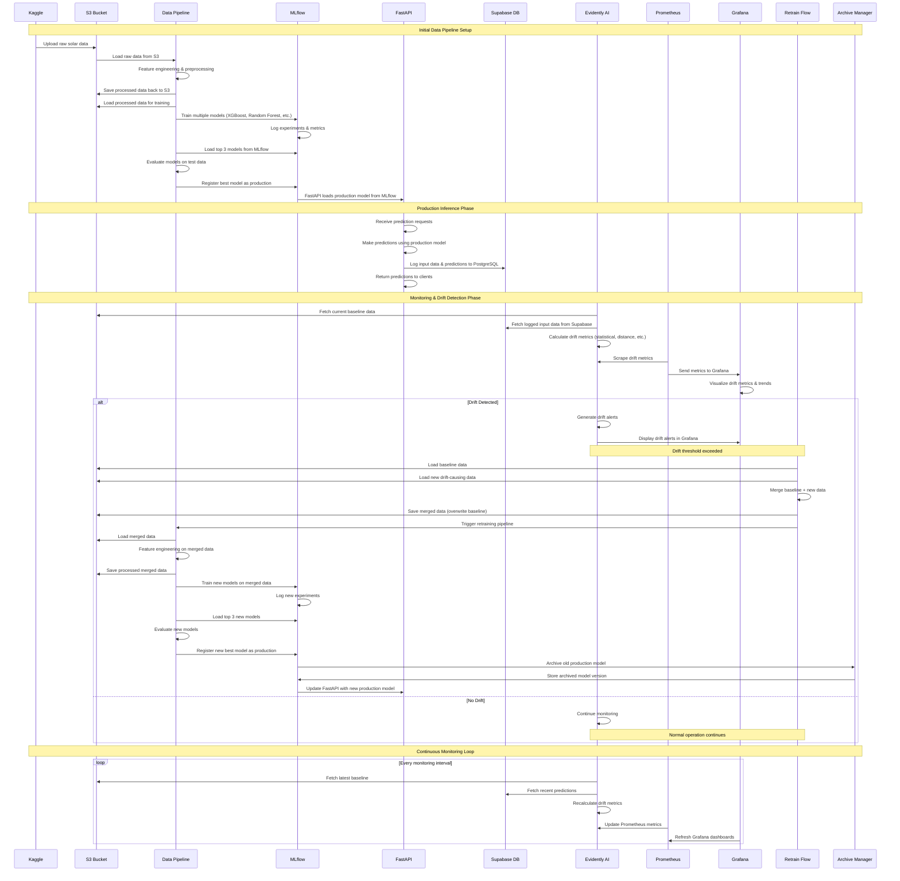

# Solar Prediction ML Pipeline - Sequence Diagram

## Key Components Explained

### Data Flow
1. **Kaggle → S3**: Initial data ingestion from Kaggle datasets
2. **S3 → Pipeline**: Data loading and processing
3. **Pipeline → MLflow**: Model training and experiment tracking
4. **MLflow → FastAPI**: Production model serving

### Monitoring Stack
- **Evidently AI**: Drift detection and analysis
- **Prometheus**: Metrics collection and storage
- **Grafana**: Visualization and alerting
- **Supabase**: Prediction logging and data storage

### Retraining Flow
- **Drift Detection**: Automated monitoring triggers retraining
- **Data Merging**: New data merged with baseline
- **Model Retraining**: Complete pipeline re-execution
- **Model Registration**: New best model becomes production
- **Model Archiving**: Old models stored for rollback capability

### Key Features
- **Automated Drift Detection**: Statistical, distance-based, and enhanced drift metrics
- **Continuous Monitoring**: Real-time metrics and visualization
- **Automated Retraining**: Triggered by drift detection
- **Model Versioning**: MLflow model registry with production/archive management
- **Prediction Logging**: Complete audit trail of inputs and outputs 